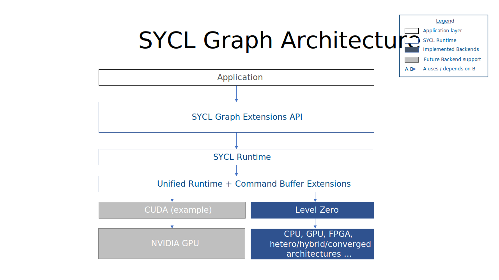

# Command Graph Extension

This document describes the implementation design of the 
[SYCL Graph Extension](https://github.com/intel/llvm/pull/5626).

A related presentation can be found 
[here](https://www.youtube.com/watch?v=aOTAmyr04rM).

## Requirements

An efficient implementation of a lazy command graph execution and its replay
requires extensions to the PI layer. Such an extension is command buffers,
where a command-buffer object represents a series of operations to be enqueued
to the backend device and their dependencies. A single command graph can be
partitioned into more than one PI command-buffer by the runtime.
We distinguish between backends that support command buffer extensions and
those that do not. Currently command buffer extensions are only supported by
Level Zero. All other backends would fall back to an emulation mode.

The emulation mode targets support of functionality only, without potentially
resulting performance improvements, i.e. execution of a closed Level Zero
command list multiple times. 

#### Command Buffer extension

| Function | Description |
| ------------------------- | ------------------------ |
| `piextCommandBufferCreate` | create a command-buffer. |
| `piextCommandBufferRetain` | incrementing reference count of command-buffer. |
| `piextCommandBufferRelease` | decrementing reference count of command-buffer. |
| `piextCommandBufferFinalize` | no more commands can be appended, makes command buffer ready to enqueue on command-queue. |
| `piextCommandBufferNDRangeKernel` | append a kernel execution command to command buffer. |
| `piextEnqueueCommandBuffer` | submit command-buffer to queue for execution |

## Design

There are two sets of user facing interfaces that are proposed to create a
command graph object: 
Explicit and Record & Replay API. Within the runtime they share a common
infrastructure.

## Scheduler integration

When there are no requirements for accessors in a command graph the scheduler
is bypassed and it is directly enqueued to a command buffer. If 
there are requirements, commands need to be enqueued by the scheduler. 

## Memory handling: Buffer and Accessor

There is no extra support for Graph-specific USM allocations in the current
proposal. Memory operations will be supported subsequently by the current
implementation starting with `memcpy`.

Buffers and accessors are supported in a command graph. Following restrictions
are required to adapt buffers and their lifetime to a lazy work execution model:

- Lifetime of a buffer with host data will be extended by copying the underlying
data.
- Host accessor on buffer that are used by a command graph are prohibited.
- Copy-back behavior on destruction of a data is prohibited. 
